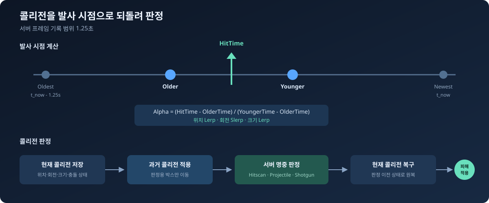
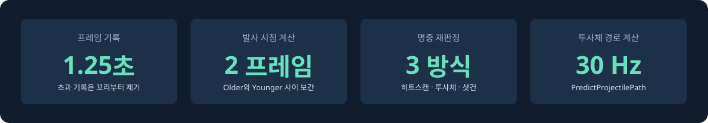
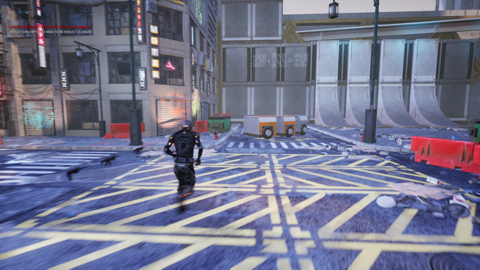
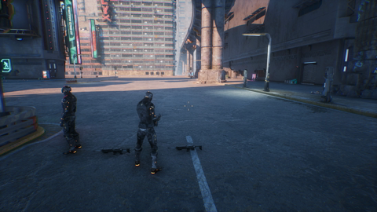
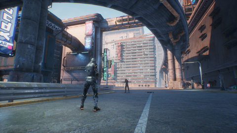

# 멀티플레이 TPS 지연 보상

서버 사이드 리와인드로 캐릭터의 콜리전을 발사 시점으로 되돌려 명중을 판정했습니다.

[플레이 영상](https://youtu.be/QH26UeeRWrM) · [리와인드 코드](Source/NetworkShooter/Private/Network/RewindHistoryComponent.cpp)



## 담당 파트

- 클라이언트와 서버 시간 동기화
- 캐릭터 콜리전 프레임 기록
- Server-Side Rewind 명중 판정
- 히트스캔, 투사체, 샷건 서버 검증
- 서버 권한 피해 처리

## 해결한 문제

클라이언트 화면에서는 맞았지만 서버에서는 빗나가는 경우가 있었습니다. 명중 요청이 서버에 도착했을 때는 상대 캐릭터가 이미 이동한 뒤였기 때문입니다.

서버가 캐릭터 콜리전을 `1.25초` 동안 기록하고, 클라이언트의 발사 시점에 해당하는 위치를 다시 계산하도록 했습니다. 계산한 위치로 판정용 콜리전을 옮겨 명중을 확인한 뒤 현재 상태로 복구했습니다.

## 리와인드 처리

1. 서버가 콜리전의 위치, 회전, 크기를 매 프레임 기록합니다.
2. 발사 시각 앞뒤의 `Older`, `Younger` 프레임을 찾습니다.
3. 위치와 크기는 `Lerp`, 회전은 `Slerp`로 보간합니다.
4. 현재 콜리전을 저장하고 판정용 콜리전을 과거 위치로 옮깁니다.
5. 무기 유형에 맞게 명중을 판정합니다.
6. 판정이 끝나면 현재 콜리전과 충돌 상태를 복구합니다.

최신 프레임 추가와 오래된 프레임 제거가 잦아 이중 연결 리스트를 사용했습니다. 기록 범위보다 오래됐거나 서버 현재보다 미래인 요청은 판정하지 않습니다.

| 단계 | 함수 | 처리 |
| --- | --- | --- |
| 기록 | `SaveCurrentFrame` | 콜리전 상태 저장, 지난 프레임 제거 |
| 탐색 | `TrySampleFrame` | 발사 시각 앞뒤 프레임 탐색 |
| 보간 | `InterpolateFrames` | 발사 시점의 콜리전 계산 |
| 적용 | `ApplyFrame` | 콜리전을 과거 위치로 이동 |
| 판정 | `ConfirmHitscan/Projectile/Shotgun` | 무기별 명중 검사 |
| 복구 | `RestoreFrame` | 현재 콜리전과 충돌 상태 복구 |

## 무기별 판정

| 무기 | 서버 판정 방식 | 제한값 |
| --- | --- | ---: |
| 히트스캔 | 과거 콜리전에 Line Trace | 최대 20,000 uu |
| 투사체 | 초기 속도로 비행 경로 재계산 | 30 Hz, 최대 30,000 uu/s |
| 샷건 | 펠릿별 Line Trace 후 피해 합산 | 최대 16개 |

클라이언트는 대상, 궤적, 발사 시각만 보냅니다. 피해량은 서버에만 두고 요청 시각, 거리, 투사체 속도, 펠릿 개수를 확인한 뒤 적용했습니다.

## 시간 동기화

클라이언트 요청의 왕복 시간에서 편도 지연을 구해 서버 기준 발사 시각을 계산했습니다. 측정값은 `5초`마다 갱신하고 이전 값에 `0.15` 비율로 반영했습니다.

```text
EstimatedServerTime = ServerReceiveTime + RTT / 2
```

## 구현 수치



## 코드

- [`RewindHistoryComponent.cpp`](Source/NetworkShooter/Private/Network/RewindHistoryComponent.cpp): 프레임 기록, 보간, 콜리전 이동과 복구
- [`NetworkClockComponent.cpp`](Source/NetworkShooter/Private/Network/NetworkClockComponent.cpp): 서버 시간 계산
- [`ValidatedWeaponComponent.cpp`](Source/NetworkShooter/Private/Combat/ValidatedWeaponComponent.cpp): 요청 검사와 서버 피해 적용
- [`ARCHITECTURE.md`](docs/ARCHITECTURE.md): 처리 순서와 예외 조건

## 플레이 화면

| 이동 | 멀티플레이 | 전투 |
| --- | --- | --- |
|  |  |  |
