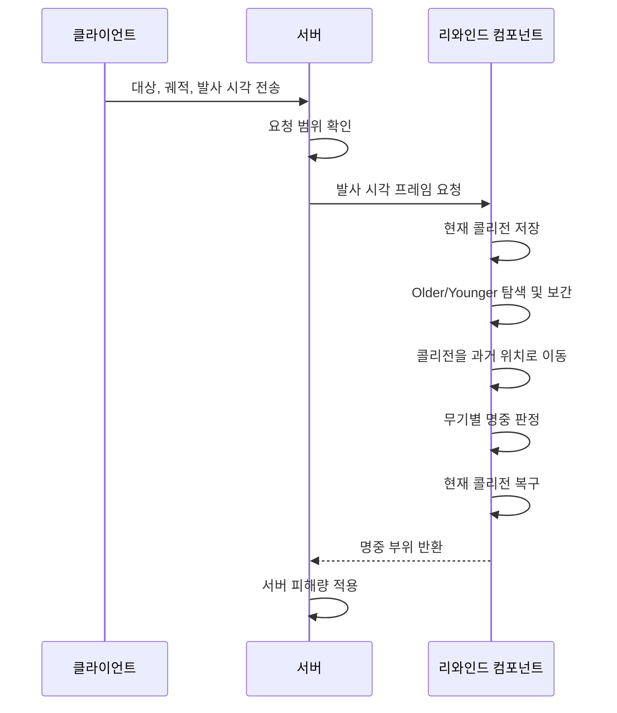

# Server-Side Rewind 기반 TPS

서버가 캐릭터의 콜리전을 발사 시점으로 되돌린 뒤 명중을 판정하도록 구현했습니다.

[플레이 영상](https://youtu.be/QH26UeeRWrM) · [리와인드 코드](Source/NetworkShooter/Private/Network/RewindHistoryComponent.cpp)


## 맡은 부분

멀티플레이 전투의 지연 보상을 맡았습니다.

- 클라이언트와 서버 시간 동기화
- 캐릭터 콜리전 프레임 기록
- 발사 시점의 콜리전 복원
- 히트스캔, 투사체, 샷건 명중 재판정
- 판정 이후 현재 콜리전 복구

## 문제

클라이언트 화면에서 맞은 총알이 서버에서는 빗나가는 경우가 있었습니다. 서버가 명중 요청을 받았을 때는 상대 캐릭터가 이미 다른 위치로 이동한 뒤였기 때문입니다.

클라이언트가 보낸 명중 결과를 그대로 적용하지 않고, 서버가 발사 시점의 콜리전을 복원해 다시 판정하는 방식으로 해결했습니다.

## 콜리전을 되돌리는 순서

1. 서버가 캐릭터의 콜리전 위치, 회전, 크기를 매 프레임 기록합니다.
2. 기록은 최신 프레임이 앞에 오도록 이중 연결 리스트에 넣습니다.
3. 발사 시각을 기준으로 앞뒤의 `Older`, `Younger` 프레임을 찾습니다.
4. 두 프레임 사이의 위치와 크기는 `Lerp`, 회전은 `Slerp`로 계산합니다.
5. 판정 직전 현재 콜리전 상태를 따로 저장합니다.
6. 판정용 콜리전을 계산한 과거 위치로 옮깁니다.
7. 캐릭터 메시 콜리전을 끄고 판정용 콜리전에만 Line Trace를 실행합니다.
8. 머리와 몸통 중 어느 콜리전에 맞았는지 확인합니다.
9. 판정이 끝나면 저장해 둔 현재 위치와 충돌 상태로 되돌립니다.

```text
Alpha = (HitTime - OlderTime) / (YoungerTime - OlderTime)
Location = Lerp(Older.Location, Younger.Location, Alpha)
Rotation = Slerp(Older.Rotation, Younger.Rotation, Alpha)
```

프레임 기록은 `1.25초`만 유지합니다. 최신 프레임 추가와 오래된 프레임 제거는 각각 `O(1)`이고, 기록 범위보다 오래된 요청은 판정하지 않습니다.

| 순서 | 함수 | 처리 내용 |
| --- | --- | --- |
| 기록 | `SaveCurrentFrame` | 콜리전 상태 저장, 지난 기록 제거 |
| 탐색 | `TrySampleFrame` | 발사 시각 앞뒤 프레임 탐색 |
| 보간 | `InterpolateFrames` | 발사 시점의 콜리전 계산 |
| 적용 | `ApplyFrame` | 판정용 콜리전을 과거 위치로 이동 |
| 판정 | `ConfirmHitscan`, `ConfirmProjectile`, `ConfirmShotgun` | 무기별 명중 검사 |
| 복구 | `RestoreFrame` | 현재 콜리전과 충돌 상태 복구 |

관련 코드: [`RewindHistoryComponent.cpp`](Source/NetworkShooter/Private/Network/RewindHistoryComponent.cpp)

## 시간 동기화

클라이언트의 월드 시간을 서버에서 바로 사용하면 발사 시각이 맞지 않습니다. 요청을 보낸 시각과 응답을 받은 시각으로 왕복 시간을 구하고, 그 절반을 서버 수신 시각에 더했습니다.

```text
RTT = ClientReceiveTime - ClientSendTime
EstimatedServerTime = ServerReceiveTime + RTT / 2
```

측정값은 `5초`마다 갱신하고 이전 값에 `0.15` 비율로 반영했습니다.

관련 코드: [`NetworkClockComponent.cpp`](Source/NetworkShooter/Private/Network/NetworkClockComponent.cpp)

## 무기별 판정

| 무기 | 리와인드 이후 판정 | 제한값 |
| --- | --- | ---: |
| 히트스캔 | 총구와 조준점 사이 Line Trace | 최대 20,000 uu |
| 투사체 | 초기 속도로 경로 재계산 | 30 Hz, 최대 30,000 uu/s |
| 샷건 | 펠릿별 Line Trace 후 피해 합산 | 최대 16개 |

클라이언트는 대상, 발사 위치, 궤적, 발사 시각만 보냅니다. 피해량은 서버에만 두었습니다. 서버는 요청 시각, 거리, 투사체 속도, 펠릿 개수를 확인한 뒤 리와인드를 실행합니다.

관련 코드: [`ValidatedWeaponComponent.cpp`](Source/NetworkShooter/Private/Combat/ValidatedWeaponComponent.cpp)

## 처리 흐름



## 구현 수치


## 플레이 화면

| 이동 | 멀티플레이 | 전투 |
| --- | --- | --- |
|  |  |  |

## 코드 보기

- [`RewindHistoryComponent.cpp`](Source/NetworkShooter/Private/Network/RewindHistoryComponent.cpp): 프레임 기록, 보간, 콜리전 이동과 복구
- [`NetworkClockComponent.cpp`](Source/NetworkShooter/Private/Network/NetworkClockComponent.cpp): 서버 시간 계산
- [`ValidatedWeaponComponent.cpp`](Source/NetworkShooter/Private/Combat/ValidatedWeaponComponent.cpp): 요청 검사와 서버 피해 적용
- [`ARCHITECTURE.md`](docs/ARCHITECTURE.md): 리와인드 처리 순서와 예외 조건
