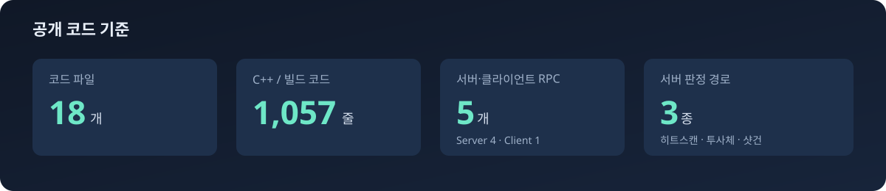
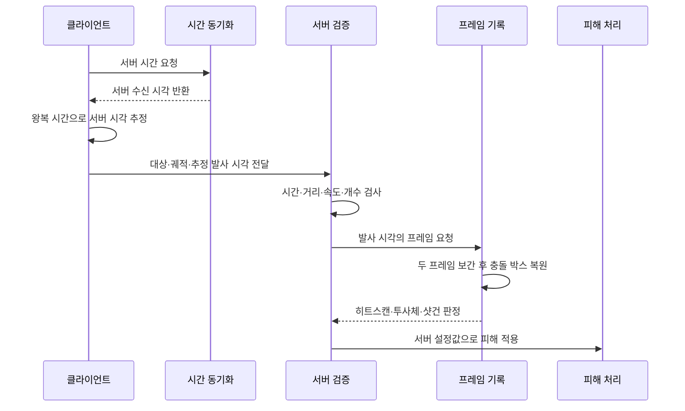

# Network Shooter Portfolio

지연이 있는 멀티플레이 환경에서 클라이언트의 명중 시점을 서버가 다시 검증하도록 만든 Unreal Engine C++ 코드 포트폴리오입니다.

[플레이 영상 보기](https://youtu.be/QH26UeeRWrM)



## 맡은 작업

멀티플레이 전투의 네트워크 처리를 담당했습니다. 클라이언트와 서버의 시간 차이를 보정하고, 서버가 과거 캐릭터 위치를 복원해 명중 여부를 다시 계산하도록 구성했습니다.

기존 프로토타입 자료가 소실된 뒤 플레이 영상과 설계 기록을 기준으로 네트워크 핵심부를 Unreal Engine 5.5 코드로 재구현했습니다. 외부 에셋과 플러그인은 저장소에서 제외했습니다.

## 문제와 해결

### 1. 클라이언트 발사 시각을 서버에서 그대로 사용할 수 없었습니다

클라이언트와 서버는 서로 다른 월드 시간을 사용합니다. 클라이언트가 보낸 시각을 그대로 적용하면 지연 시간만큼 판정 위치가 어긋납니다.

요청 왕복 시간을 측정해 편도 지연을 계산하고, 서버 수신 시각에 편도 지연을 더해 서버 현재 시각을 추정했습니다. 측정값이 한 번에 튀지 않도록 보정값에 `0.15` 비율의 평활화를 적용하고 `5초`마다 다시 동기화했습니다.

관련 코드: [`NetworkClockComponent.cpp`](Source/NetworkShooter/Private/Network/NetworkClockComponent.cpp)

### 2. 화면에서는 맞았지만 서버에서는 빗나가는 문제가 있었습니다

서버가 명중 요청을 받을 때는 대상 캐릭터가 이미 다른 위치로 이동한 뒤입니다. 현재 위치만 검사하면 네트워크 지연이 큰 플레이어일수록 명중 판정이 불리해집니다.

서버가 충돌 박스 상태를 `1.25초` 동안 이중 연결 리스트에 기록하도록 했습니다. 요청 시각을 감싸는 두 프레임을 찾고 위치·회전을 보간한 뒤, 충돌 박스를 해당 시점으로 이동시켜 판정합니다. 검사가 끝나면 즉시 현재 위치와 충돌 상태를 복구합니다.

관련 코드: [`RewindHistoryComponent.cpp`](Source/NetworkShooter/Private/Network/RewindHistoryComponent.cpp)

### 3. 무기마다 같은 판정 방식을 쓸 수 없었습니다

히트스캔은 선분 검사로 끝나지만 투사체는 속도와 비행 시간이 필요하고, 샷건은 여러 펠릿의 명중 결과를 합산해야 합니다.

명중 검증 입구는 하나의 컴포넌트로 묶고 서버 내부 판정만 세 갈래로 나눴습니다.

| 무기 유형 | 서버 재검증 방식 | 제한값 |
| --- | --- | ---: |
| 히트스캔 | 과거 충돌 박스에 선분 추적 | 최대 20,000 uu |
| 투사체 | 초기 속도로 경로 재계산 | 30 Hz, 최대 30,000 uu/s |
| 샷건 | 펠릿별 선분 추적 후 피해 합산 | 최대 16개 |

관련 코드: [`ValidatedWeaponComponent.cpp`](Source/NetworkShooter/Private/Combat/ValidatedWeaponComponent.cpp)

### 4. 클라이언트가 피해량을 조작할 수 있었습니다

클라이언트가 피해량까지 보내면 패킷 변조로 결과를 바꿀 수 있습니다. 클라이언트는 대상, 발사 위치, 판정 시각만 전달하고 피해량은 서버 설정값만 사용하도록 분리했습니다.

서버는 판정 전에 요청 시각, 발사 거리, 투사체 속도, 펠릿 개수를 검사합니다. 조건을 통과하고 리와인드 결과가 명중일 때만 `ApplyDamage`를 호출합니다.

## 처리 흐름



## 플레이 화면

| 이동 및 무기 배치 | 멀티플레이 캐릭터 | 전투 장면 |
| --- | --- | --- |
|  |  |  |

## 기술 스택

- Unreal Engine 5.5: 공개용 네트워크 코드 재구현
- Unreal Engine 4.27: 기존 플레이 프로토타입 및 영상
- C++: 캐릭터, 무기 요청 검증, 프레임 기록, 시간 동기화
- Unreal RPC: `Server`, `Client`, `Reliable`, `Unreliable`
- Replication: 서버 권한 체력과 `RepNotify`
- Collision Query: 전용 `RewindHitBox` 채널 기반 선분 추적
- Projectile Prediction: `PredictProjectilePath`를 이용한 투사체 재검증

## 코드 구조

```text
Source/NetworkShooter
├─ Public
│  ├─ Character       서버 권한 체력과 리와인드 충돌 박스
│  ├─ Combat          클라이언트 요청 및 서버 피해 검증
│  ├─ Game            기본 게임 모드 연결
│  ├─ Network         시간 동기화, 프레임 구조, 리와인드
│  └─ Player          시간 동기화 컴포넌트 소유
└─ Private            각 기능 구현
```

면접 코드 검토 순서는 `NetworkClockComponent` → `RewindHistoryComponent` → `ValidatedWeaponComponent` 순서로 보면 됩니다. 세 파일이 시간 보정, 과거 위치 복원, 서버 판정을 각각 담당합니다.

자세한 설계와 예외 처리는 [`docs/ARCHITECTURE.md`](docs/ARCHITECTURE.md)에 정리했습니다.

## 저장소 범위

이 저장소에는 C++ 소스와 설정, 직접 촬영한 플레이 화면만 포함합니다. 캐릭터·맵·무기·사운드 에셋, 빌드 결과물, 외부 세션 플러그인은 포함하지 않습니다. 따라서 플레이 가능한 배포본이 아니라 네트워크 코드 검토용 저장소입니다.

## 표기

- 포트폴리오 코드 작성 및 재구현: 강형순
- Unreal Engine 및 관련 상표: Epic Games, Inc.
- Unreal 기본 생성 파일의 Epic 저작권 문구는 원문을 유지했습니다.
- 파일별 표기와 제외 범위: [`NOTICE.md`](NOTICE.md)
